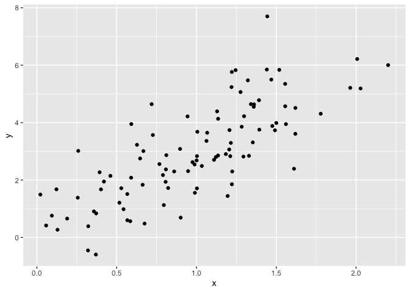
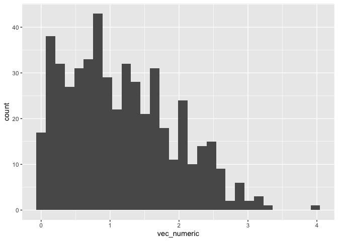

Simple document
================
Chelsey Oppan
2025-09-11

I’m an R Markdown document!

R code chunk shortcut - option + command + I

``` r
library(tidyverse)
```

shows code but hides message you write

``` r
library(tidyverse)
```

shows the code but does not evaluate it

``` r
library(tidyverse)
```

# Section 1

Here’s a **code chunk** that samples from a *normal distribution*:

``` r
samp = rnorm(100)
length(samp)
```

    ## [1] 100

click “knit” to create R markdown document

# Section 2

I can take the mean of the sample, too! The mean is -0.0609629. (in line
R code - allows you to do R code interspersed within in text)

# Section 3

This is where I’m going to talk about code chunks.

``` r
mean(samp)
```

    ## [1] -0.06096287

``` r
sd(samp)
```

    ## [1] 0.9714911

let’s also make a data frame.

``` r
example_df = 
  tibble(
    vec_numeric = 1:4,
    vec_char = c("my", "name", "is", "chels"),
    vec_factor = factor(c("male", "male", "female", "female"))
  )
```

I’ll create a new data frame

``` r
new_df = 
  tibble(
    x = rnorm(100),
    y = 1+2 * x + rnorm(100)
  )
```

Let’s make a plot and see how cool that is!

``` r
plot_df = 
  tibble(
     x = rnorm(100, mean = 1, sd = .5),
    y = 1 + 2 * x + rnorm(100)
  )

ggplot(plot_df, aes(x=x, y=y,)) + geom_point()
```

<!-- -->

# Section 4

This chunk is a learning assessment.

``` r
learning_df = 
  tibble(
    x = rnorm(500, mean =1),
    vec_log = x > 0,
    vec_numeric = abs(x)
  )

ggplot(learning_df, aes(x=vec_numeric)) + geom_histogram()
```

    ## `stat_bin()` using `bins = 30`. Pick better value with `binwidth`.

<!-- -->
